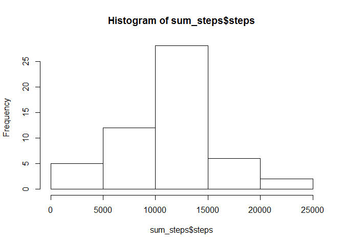
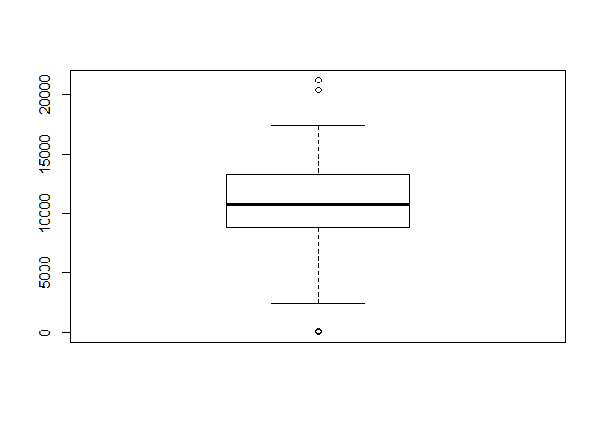
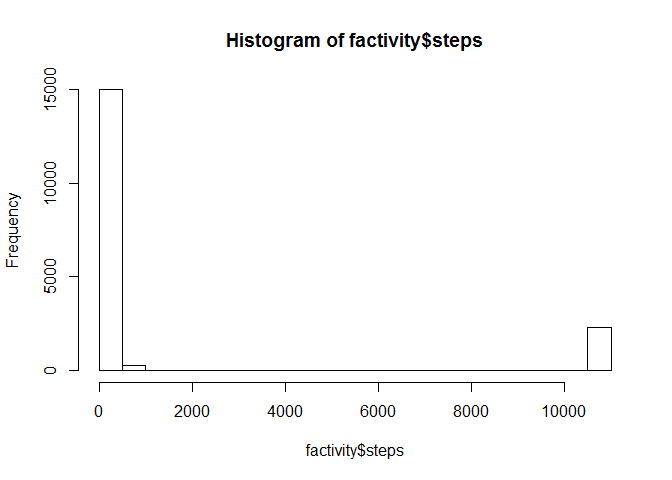
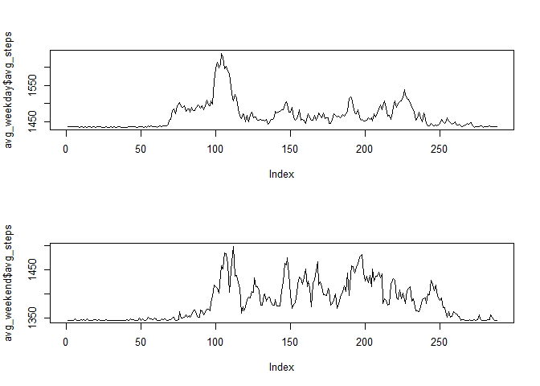

# Reproducible Research: Peer Assessment 1


## Loading and preprocessing the data


```r
##load the data
download.file("https://d396qusza40orc.cloudfront.net/repdata%2Fdata%2Factivity.zip", "Factivity.zip")
unzip("Factivity.zip")
factivity <-read.csv("activity.csv", header = TRUE)

##type factivity$date as date-type
library(lubridate)
factivity$date = ymd(factivity$date)
```


## What is mean total number of steps taken per day?


```r
##eliminate NAs
library(dplyr);
factivitiy_clean = factivity[!is.na(factivity$steps),];

##calc total steps per day
sum_steps = factivitiy_clean %>% 
  group_by(date) %>%
summarize(steps = sum(steps)) %>%
arrange(date);

hist(sum_steps$steps)
```

<!-- -->

```r
boxplot(sum_steps$steps)
```

<!-- -->

```r
mean(sum_steps$steps)
```

```
## [1] 10766.19
```

```r
median(sum_steps$steps)
```

```
## [1] 10765
```


## What is the average daily activity pattern?


```r
##calc avg steps per interval
avg_factivity = factivitiy_clean %>%
group_by(interval) %>%
summarize(avg_steps = mean(steps)) %>%
arrange(interval);

##plot
library(ggplot2) 
ggplot(avg_factivity, aes(interval, avg_steps)) + geom_line()
```

<!-- -->

```r
##interval with max steps
avg_factivity[avg_factivity$avg_steps == max(avg_factivity$avg_steps),]
```

```
## Source: local data frame [1 x 2]
## 
##   interval avg_steps
##      (int)     (dbl)
## 1      835  206.1698
```


## Imputing missing values


```r
##number of NA-rows
nrow(factivity[is.na(factivity$steps),])
```

```
## [1] 2304
```


```r
##replace NAs with median
factivity$steps[is.na(factivity$steps)] = mean(sum_steps$steps)
```


```r
##histogramm and avgs evaluation
hist(factivity$steps)
```

<!-- -->

```r
median(factivity$steps)
```

```
## [1] 0
```

```r
mean(factivity$steps)
```

```
## [1] 1444.439
```

## Are there differences in activity patterns between weekdays and weekends?

```r
Sys.setlocale("LC_TIME", "English")
```

```
## [1] "English_United States.1252"
```

```r
##create factor variable
factivity$day_type = factor(ifelse(weekdays(factivity$date) == "Sunday" | weekdays(factivity$date) == "Saturday", "weekend", "weekday")  ,c("weekend", "weekday"))

##plot steps weekday vs weekend
avg_weekday = factivity[factivity$day_type == "weekday",] %>%
group_by(interval) %>%
summarize(avg_steps = mean(steps)) %>%
arrange(interval);


avg_weekend = factivity[factivity$day_type == "weekend",] %>%
group_by(interval) %>%
summarize(avg_steps = mean(steps)) %>%
arrange(interval);

par(mfrow = c(2, 1), cex = 0.8)
plot(avg_weekday$avg_steps, type = "l")
plot(avg_weekend$avg_steps, type = "l")
```

<!-- -->

